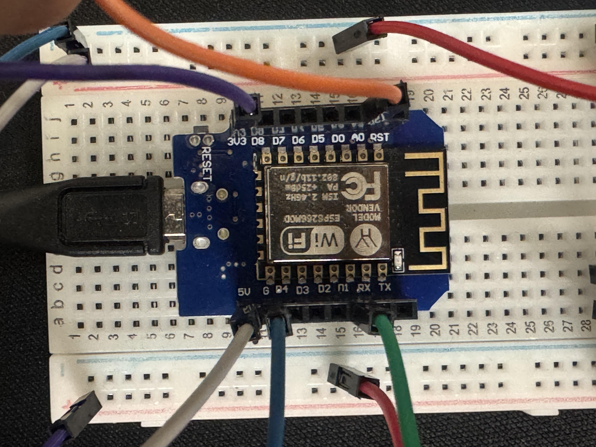

# 🌍 IoT Air Quality & Humidity Monitor

ESP8266 (Wemos D1 Mini) tabanlı bir **hava kalitesi ve nem ölçüm sistemi**.  
Sistem, **DHT11** ile sıcaklık/nem ölçümü yapar, **MQ-135** ile hava kalitesini algılar ve kritik değerlerde **e-posta bildirimi** gönderir.

---

## 🚀 Özellikler
- Gerçek zamanlı sıcaklık ve nem ölçümü
- MQ-135 sensörü ile hava kalitesi takibi
- Kritik değerlerde **otomatik e-posta bildirimi**
- Wi-Fi üzerinden sürekli bağlantı kontrolü
- Basit kurulum ve genişletilebilir yapı

---

## 🔧 Donanım Gereksinimleri
- ESP8266 (Wemos D1 Mini)
- DHT11 sıcaklık & nem sensörü
- MQ-135 hava kalitesi sensörü
- Breadboard (opsiyonel)
- Jumper kablolar
- USB kablosu

---

## 🔌 Devre Bağlantıları
- **DHT11**
  - VCC → 3.3V  
  - GND → GND  
  - DATA → D1 (GPIO5)  

- **MQ-135**
  - VCC → 5V  
  - GND → GND  
  - AOUT → A0  

⚠️ Eğer modülünüz 5V çıkış veriyorsa, **direnç bölücü** ile A0 girişini 3.3V’a düşürün.

📌 Ayrıntılar için:  
  

---

## 💻 Yazılım Gereksinimleri
- Arduino IDE (>=1.8.19) veya PlatformIO
- ESP8266 Board Package  
  (URL: `http://arduino.esp8266.com/stable/package_esp8266com_index.json`)
- Kütüphaneler:
  - DHT sensor library (Adafruit)
  - ESP Mail Client (Mobizt)

---

## ⚙️ Kurulum
1. Bu repoyu klonlayın.

2.	Arduino IDE’de code/main.ino dosyasını açın.

3.	secrets.h dosyasını oluşturup kendi bilgilerinizi girin:
    - #define WIFI_SSID "YourWiFi"
    - #define WIFI_PASSWORD "YourPassword"
    - #define SMTP_HOST "smtp.gmail.com"
    - #define SMTP_PORT 587
    - #define SENDER_EMAIL "youremail@gmail.com"
    - #define SENDER_PASS "your_app_password"
    - #define RECEIVER_EMAIL "receiver@example.com"

4.	Kartı Wemos D1 Mini seçip kodu yükleyin.

5.	Seri monitörden (115200 baud) çıktıları takip edin.

📊 Örnek Seri Monitör Çıktısı

[BOOT] IoT Air Quality Monitor
[WiFi] Baglaniyor... OK
[INFO] Warm-up: 60-120 sn
[DHT] T: 25.4 C, H: 41.2 %
[MQ] 187
[ALARM] Tetiklendi -> Hava kalitesi esigi
[MAIL] Gonderildi.

YouTube Videosu/Fransızca: [https://youtu.be/H_EUtlyBPwQ]